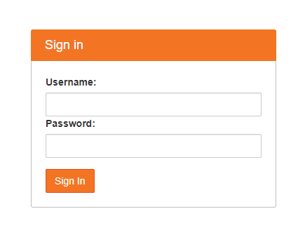
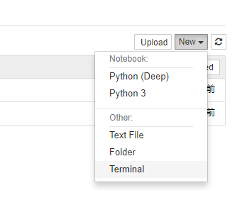
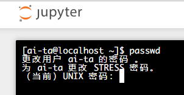
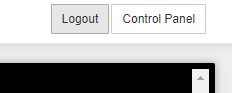
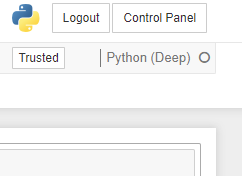
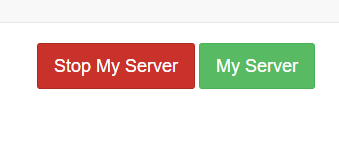
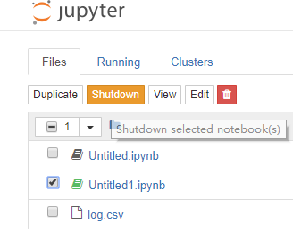

# 人工智能原理课程实习

<!-- TOC -->

- [人工智能原理课程实习](#人工智能原理课程实习)
    - [一、系统登录和密码修改](#一系统登录和密码修改)
    - [二、有关GPU的注意事项（很重要）](#二有关gpu的注意事项很重要)
        - [1.设定GPU显存为自增长模式](#1设定gpu显存为自增长模式)
        - [2.释放GPU内存](#2释放gpu内存)

<!-- /TOC -->

## 一、系统登录和密码修改

1. 登录系统，访问邮件中给出的地址，在登录界面上输入自己组的用户名密码



2. 进入JupyterHub后，点击页面右上角`New`->`Terminal`




3. 在打开的终端输入命令,按照提示修改密码：

``` sh
passwd
```



4. 点击右上角的logout，然后用新修改的密码重新登录系统




## 二、有关GPU的注意事项（很重要）

### 1.设定GPU显存为自增长模式

Tensorflow默认会占用GPU的全部显存，如果不对显存进行一些设定，当一个人完全占用了GPU之后，其他同学将无法正常使用GPU资源。

使用Tensorflow：

``` python
import tensorflow as tf

config = tf.ConfigProto()
config.gpu_options.allow_growth = True

# Graph ...
x = tf.add(3, 4)

# Run
with tf.Session(config=config) as sess:
    sess.run(x)
```

使用Keras：

``` python
import tensorflow as tf
from keras import backend as K

config = tf.ConfigProto()
config.gpu_options.allow_growth = True
session = tf.Session(config=config)
K.set_session(session)

# ...
```

使用其他框架或者不使用jupyter notebook的同学也请注意同样的问题。

### 2.释放GPU内存

**上机结束后一定要关闭自己的Server/打开的notebook，或者关闭自己的程序，释放GPU内存！**

1. Stop My Server 

点击右上角的`Control Panel`，然后在打开的页面中点击`Stop My Server`：





2. Shutdown kernel

在目录里选择打开的notebook，然后点击`Shutdown`



不使用jupyter notebook的同学也请注意同样的问题。
